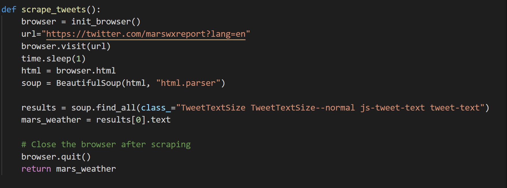

### Web scraping homework!

1. In this homework, I build 3 files: **scrape_mars.py**, **app.py** and **index.html** in templates folder.
2. In **scrape_mars.pyI**, this is the file that I defined functions to scrape information from:
   - *https://mars.nasa.gov/news/?page=0&per_page=40&order=publish_date+desc%2Ccreated_at+desc&search=&category=19%2C165%2C184%2C204&blank_scope=Latest*
   
   
   
   - *https://www.jpl.nasa.gov/spaceimages/?search=&category=Mars*
   
   
   
   - *https://twitter.com/marswxreport?lang=en*
   
   
   
   - *https://space-facts.com/mars/*
   
   
   
   - *https://astrogeology.usgs.gov/search/results?q=hemisphere+enhanced&k1=target&v1=Mars*
   
   
   
3. After we have functions already, in the **app.py**, we bulid application using **Flask** and **render_template** to show the information scraped into an html file in **templates** folder. We built two links ***"/"*** and ***"/scrape"***.
4. We also use **PyMongo** to set up a connection with local database Mongo to store the data scraped into local database and query the data to show on html page.
5. In ***"/"***, the code will query the current data in database and show on **index.html** using **render_template**.
6. In ***"/scrape"***, we call functions from scrape_mars.py to scrape new data, then store the data into MongoDB. At the end of code, we return the program by *redirect("/", code=302)* to call the ***"/"*** app.
7. In html file, we show information from database by the default ***"/"*** app. 

8. Then if we would like to have updated information on page, we can click the button to get the data by calling ***"/scape"*** app.

   
   
   
   
